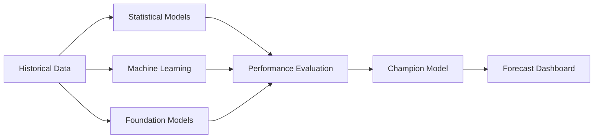

# Forecast Model Comparison

## Overview

ForecastIQ supports multiple forecasting techniques ranging from traditional statistical models to modern Machine Learning and Foundation Models.

Rather than relying on a single forecasting algorithm, ForecastIQ evaluates multiple models and automatically recommends the most suitable model based on business objectives and forecasting accuracy.

---

# Forecasting Strategy



---

# Forecasting Categories

## 1. Statistical Models

Traditional mathematical forecasting models.

Examples

- Naïve Forecast
- Moving Average
- ARIMA
- SARIMA
- SARIMAX
- ETS
- TBATS

Best suited for

- Stable time series
- Strong seasonality
- Small datasets

Advantages

- Explainable
- Fast
- Reliable
- Business friendly

Limitations

- Difficult to capture nonlinear behaviour
- Limited external feature interaction

---

## 2. Machine Learning Models

ForecastIQ supports modern regression-based forecasting.

Examples

- Random Forest
- XGBoost
- LightGBM
- CatBoost
- Extra Trees

Best suited for

- Multiple business drivers
- Promotions
- Holidays
- Contact Ratio
- External variables

Advantages

- Handles nonlinear relationships
- Excellent accuracy
- Works well with engineered features

Limitations

- Requires feature engineering
- Requires sufficient training data

---

## 3. Foundation Models

Pre-trained forecasting models.

Examples

- TimesFM
- Chronos
- TimeGPT

Best suited for

- Zero-shot Forecasting
- Minimal feature engineering
- Long forecasting horizons

Advantages

- Minimal training
- Strong generalization
- State-of-the-art forecasting

Limitations

- Computationally intensive
- Limited explainability

---

# Model Comparison Matrix

| Category | Model | Strength | Weakness | Business Use |
|----------|--------|----------|----------|--------------|
| Statistical | ARIMA | Trend | No seasonality | Stable demand |
| Statistical | SARIMA | Trend + Seasonality | Limited features | Retail |
| Statistical | SARIMAX | External variables | Feature preparation | Contact Center |
| Statistical | TBATS | Multiple seasonalities | Slow | Energy |
| ML | Random Forest | Easy | Moderate accuracy | Baseline |
| ML | XGBoost | High Accuracy | Tuning required | Enterprise |
| ML | LightGBM | Fast | Parameter tuning | Large Data |
| ML | CatBoost | Handles categorical variables | Slower | Retail |
| FM | TimesFM | Zero-shot | GPU recommended | Enterprise AI |
| FM | Chronos | Long Horizon | Limited explainability | Demand Forecast |
| FM | TimeGPT | Generalized Forecast | API dependency | Business Forecast |

---

# Model Evaluation Metrics

ForecastIQ compares every model using

- MAPE
- RMSE
- MAE
- SMAPE
- R²
- AIC
- AICc
- BIC

---

# Champion Model Selection

ForecastIQ does not assume one model is always the best.

The Champion Model is selected based on

- Forecast Accuracy
- Generalization
- Stability
- Business Interpretability
- Computational Efficiency

---

# Decision Framework

```mermaid
flowchart TD

Data

-->

Statistical Models

-->

Machine Learning

-->

Foundation Models

-->

Performance Evaluation

-->

Champion Model

-->

Business Forecast
```

---

# ForecastIQ Recommendation

ForecastIQ recommends comparing multiple forecasting approaches before selecting the final forecasting model.

Different datasets may require different forecasting techniques depending on trend, seasonality, business drivers, and forecasting horizon.

