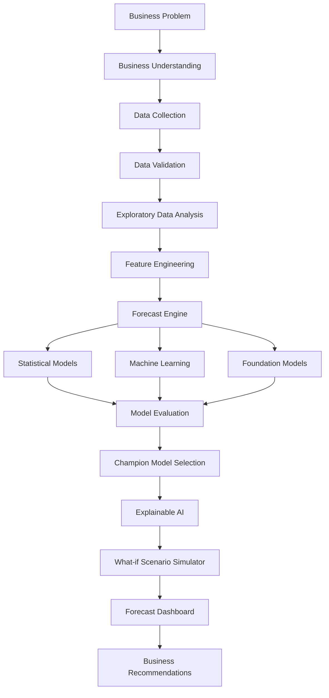

# Solution Architecture

## Overview

ForecastIQ follows a modular, end-to-end forecasting architecture that transforms raw business data into actionable forecasts and business recommendations.

The platform combines:

- Statistical Forecasting
- Machine Learning
- Foundation Models
- Explainable AI
- Scenario Planning
- Interactive Dashboards

---

# High-Level Architecture

---

# Architecture Components

## 1. Business Understanding

Understand the forecasting objective.

Examples:

- Cases Created Forecast
- Sales Forecast
- Demand Forecast
- Workforce Planning

---

## 2. Data Collection

ForecastIQ supports multiple data sources.

Examples:

- CSV
- Excel
- SQL Database
- API
- Cloud Storage

Typical Inputs

- Weekly Date
- Sales Forecast
- Cases Created
- Promotion Calendar
- Holiday Calendar
- Contact Ratio
- External Variables

---

## 3. Data Validation

Before training the model, ForecastIQ validates:

- Missing Values
- Duplicate Records
- Invalid Dates
- Outliers
- Frequency Consistency

---

## 4. Exploratory Data Analysis

ForecastIQ automatically generates:

- Trend Analysis
- Seasonality
- Correlation Matrix
- Distribution
- Rolling Statistics
- ACF/PACF

---

## 5. Feature Engineering

Generated Features include:

- Lag Features
- Rolling Mean
- Rolling Standard Deviation
- Week Number
- Month
- Quarter
- Holiday Flag
- Promotion Flag

---

## 6. Forecast Engine

ForecastIQ compares multiple forecasting techniques instead of relying on a single model.

### Statistical Models

- Naïve Forecast
- Moving Average
- ARIMA
- SARIMA
- SARIMAX
- ETS
- TBATS

### Machine Learning

- Random Forest
- XGBoost
- LightGBM
- CatBoost

### Foundation Models

- TimesFM
- Chronos
- TimeGPT

---

## 7. Model Evaluation

Models are evaluated using:

- MAPE
- RMSE
- MAE
- SMAPE
- R²
- AIC
- AICc
- BIC

---

## 8. Champion Model Selection

ForecastIQ automatically identifies the most suitable model based on:

- Forecast Accuracy
- Stability
- Generalization
- Business Interpretability

---

## 9. Explainable AI

ForecastIQ provides transparency using:

- Feature Importance
- Residual Analysis
- Error Distribution
- SHAP (Future Enhancement)

---

## 10. What-if Scenario Simulator

Business users can simulate:

- Sales Increase
- Promotion Impact
- Holiday Effects
- Contact Ratio Changes
- External Demand Drivers

without retraining the forecasting model.

---

## 11. Forecast Dashboard

Interactive dashboards include:

- KPI Cards
- Historical Trend
- Forecast Plot
- Confidence Interval
- Model Comparison
- Download Reports

---

# Benefits

ForecastIQ enables organizations to:

- Improve Forecast Accuracy
- Reduce Operational Cost
- Improve Workforce Planning
- Support Better Business Decisions
- Compare Multiple Forecasting Techniques
- Build Explainable Forecasting Pipelines
